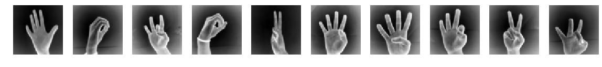
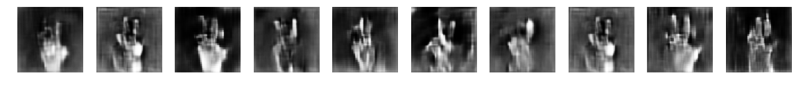

# DCGAN Sign Language
### By Arda Mavi

Generating sign language images with `DCGAN` using our own [Sign Language Dataset](https://github.com/ardamavi/Sign-Language-Digits-Dataset).

## The under construction!

## Examples:

|Dataset Examples|
|:-:|
||

|Generated Examples|
|:-:|
||
###### `Generated Examples` were taken from good samples in random epochs.

## Getting Dataset:
`cd Data && chmod +x download_dataset.sh && ./download_dataset.sh`
#### More about Dataset:
[github.com/ardamavi/Sign-Language-Digits-Dataset](https://github.com/ardamavi/Sign-Language-Digits-Dataset)

## Important Notes:
- Used Python Version: 3.6.0
- Install necessary modules with `sudo pip3 install -r requirements.txt` command.
- Not forget to [download dataset](#getting-dataset) before training!

# TODO List:
- [ ] Apply `Data Augmentation` to dataset.
